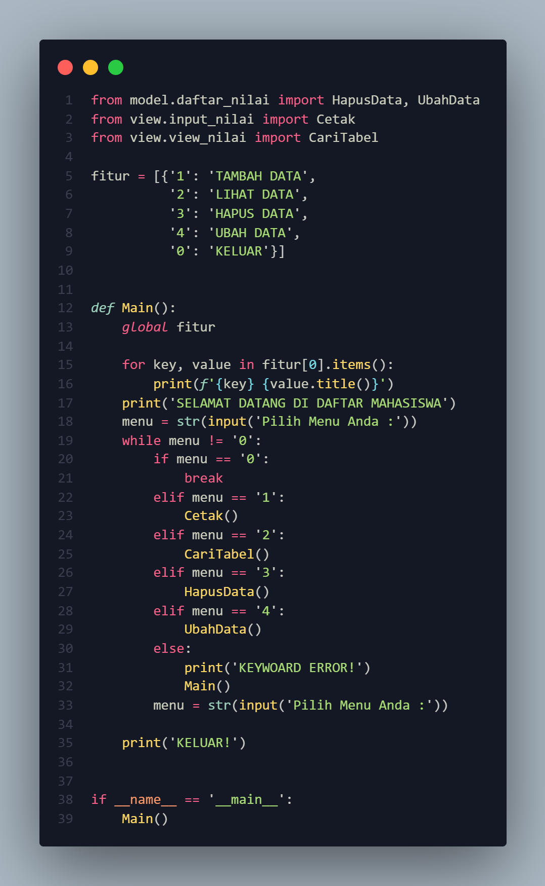
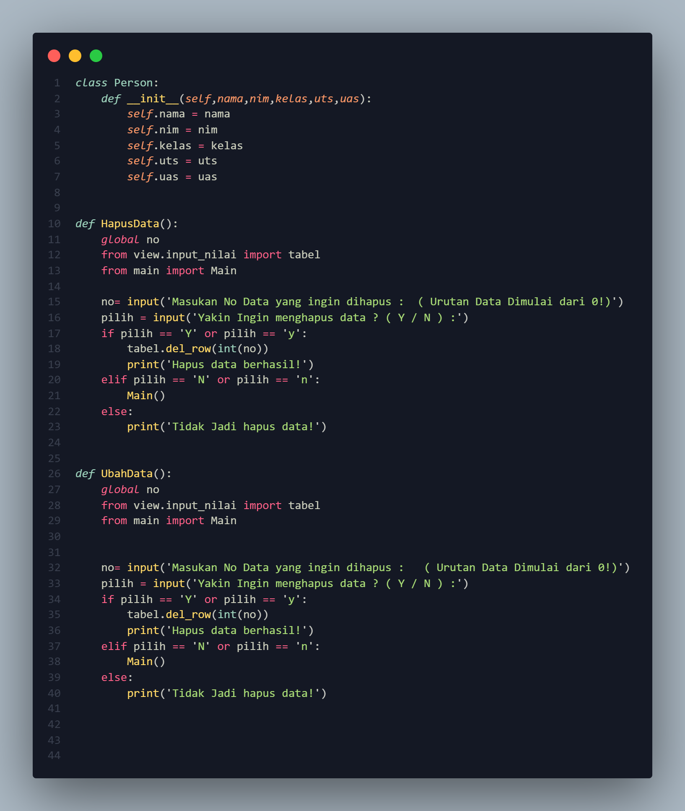
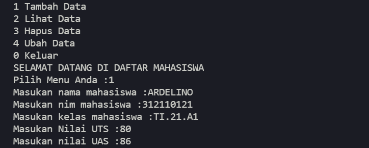
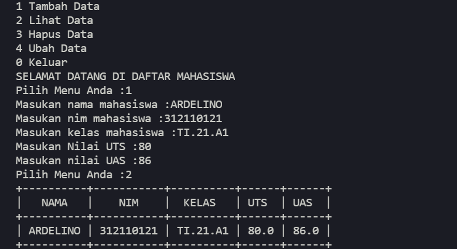
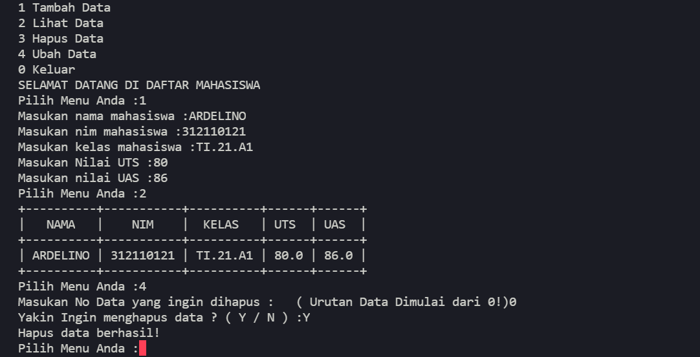

# UAS-PEMOGRAMAN-SMT1

# penjelasan
Pada file main.py berisi daftar pilihan menu dengan sintaks sebagai berikut:
 

 
<h1>Pada folder model dengan nama file daftar_nilai berisi modul untuk tambah data,hapus data,ubah data ,dan cari data,sintaksnya sebagai berikut </h1>

 
pada menu pertama terdapat fitur tambah data dengan sintaks berikut:
def Main():
    global fitur

    for key, value in fitur[0].items():
        print(f'{key} {value.title()}')
    print('SELAMAT DATANG DI DAFTAR MAHASISWA')
    menu = str(input('Pilih Menu Anda :'))
    while menu != '0':
        if menu == '0':
            break
        elif menu == '1':
            Cetak()
            
 

 
pada menu ke-dua terdapat fitur lihat data yang telah di inputkan oleh user dengan gambar berikut
 

menu ke-tiga fitur Hapus Data dengan hasil output sebagai berikut
 

